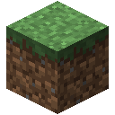

	<h1>我的世界简易材质包生成器</h1>

	
Minecraft SimpleTexturePack Generator

	
这是一个由蛋白后宫出品的简易材质包生成小工具，它可以帮助你快速生成我的世界简易版材质包。

	
开源仓库：<a href="https://gitee.com/dbhg/Minecraft_SimpleTexturePack_Generator">Gitee</a> | <a href="https://github.com/dbhg-studio/Minecraft_SimpleTexturePack_Generator">Github</a>

	
<a href="https://dbhg.top">蛋白后宫</a> | <a href="https://alwolf.cn">作者主页</a>

	
能否点亮右上角的Star，谢谢你啦OVO!!

## 界面展示

## 特点

- **简单易用**：用户友好的界面，让编辑材质与生成材质包变得简单快捷。
- **可编辑**：能直接调用图片编辑器进行编辑贴图。
- **支持性**：支持我的世界的1.7.10、1.12.2和1.16.5。

## 使用方法

1. **下载工具**：从本仓库的[Releases](../../releases)中下载工具到本地。
2. **打开工具**：解压并运行工具。
3. **创建材质包**：根据提示选择你想要的材质类型和元素。
4. **选择材质添加**：选择你想要的材质添加至编辑器区。
5. **选择材质编辑**：在编辑器区选择你想要的材质点击编辑，或者右键更多操作。
6. **生成材质包**：点击打包按钮，工具会自动生成材质包。
7. **应用材质包**：将生成的材质包放入我的世界的材质包文件夹中，然后在游戏设置中应用。

**视频教程**

## 安装需求

- Window 7 以上的系统版本

- 支持并已经安装了NET Framework 4.7.2 以上的版本

## 支持

作者本人比较懒，如果作者自己用的时候遇到bug了会修复的，如果你遇到了bug也欢迎在Issues中告知我们。

## 贡献

如果你有兴趣为这个项目贡献代码或者提供材质，欢迎Fork本仓库并提交Pull Request。

## 许可

本工具使用[MIT许可证](LICENSE)。

## 使用

| 组件名                      | 许可证 | 组件版本号 |
|---------------------------|:--------:|:---------:|
| AdonisUI.ClassicTheme     | MIT      | 1.17.1    |
| Newtonsoft.Json           | MIT      | 13.0.3    |
| Microsoft.Xaml.Behaviors.Wpf | MIT      | 1.1.77     |
| MaterialDesignThemes      | MIT      | 5.0.0-ci498 |
| AdonisUI                  | MIT      | 1.17.1    |
| AduSkin      | GPL-3.0      | 1.2.0 |
| MaterialDesignColors      | MIT      | 3.0.0-ci498 |

## 致谢

感谢社区的每一位玩家和开发者的支持，没有你们就没有这个工具的诞生。

---

祝你在我的世界中享受无限乐趣！
